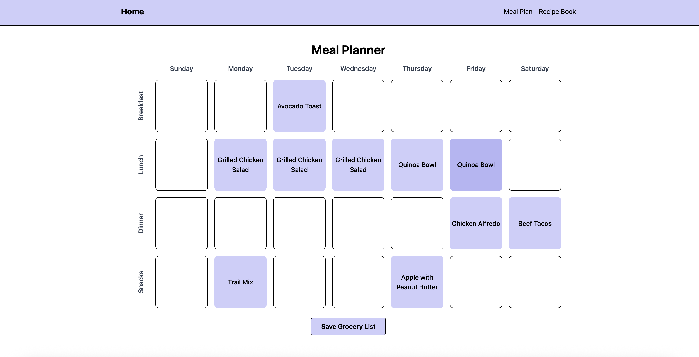
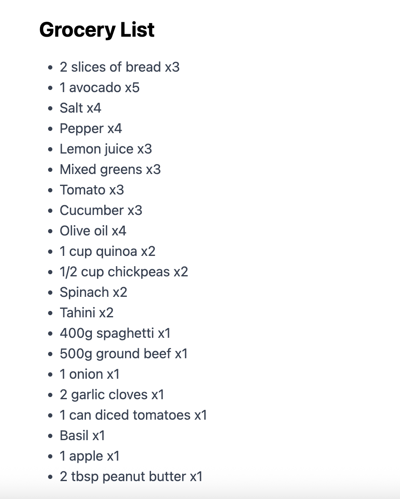
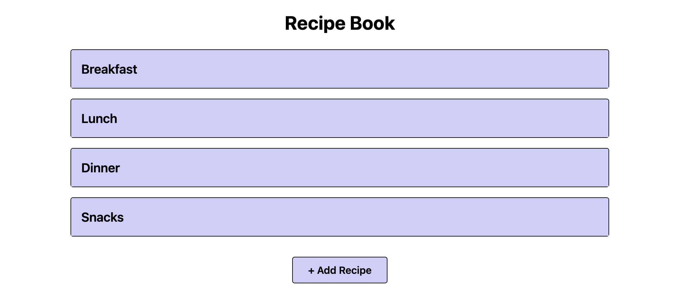
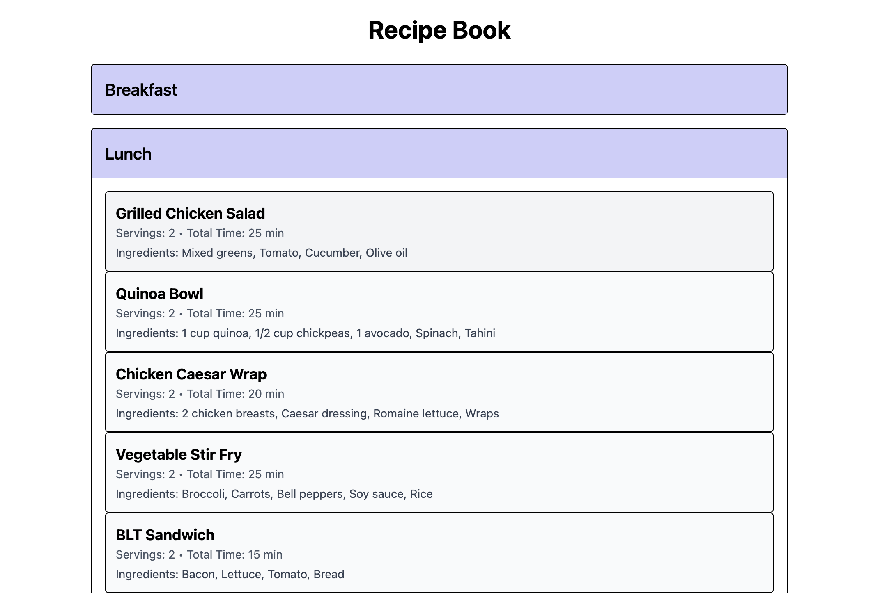

# 🥗 Meal Planner App

A full-stack web application that helps users organize their meals by saving recipes and planning them on an interactive calendar. Built with the MERN stack (MongoDB, Express.js, React, Node.js), this project showcases robust CRUD operations, RESTful API design, and full integration between front-end and back-end systems.

## 🚀 Features

- 📚 **Recipe Management**  
  Create, read, update, and delete your favorite recipes with titles, ingredients, and instructions.

- 📅 **Interactive Meal Planner**  
  A calendar view where each day can be clicked to assign a saved recipe. Grocery list for the meal plan is outputted.

- 🔁 **RESTful API**  
  Built with Express.js and Node.js to handle all data transactions via secure, organized endpoints.

- 🗃️ **MongoDB Database with Mongoose**  
  Efficient schema design for storing user recipes and meal plans.

- 🎨 **React Frontend**  
  Clean, responsive UI for an intuitive planning and recipe experience.

## 🛠️ Tech Stack

- **Frontend:** React, JavaScript, CSS, Tailwind
- **Backend:** Node.js, Express.js
- **Database:** MongoDB
- **API Style:** REST

## 📸 Screenshots

Meal Plan and Grocery List

Dropdown Menu of Saved Recipes

## 🔮 Future Improvements

- UI updates and improvements
- Login functionality
- Nutritional data
- Redux for state management
